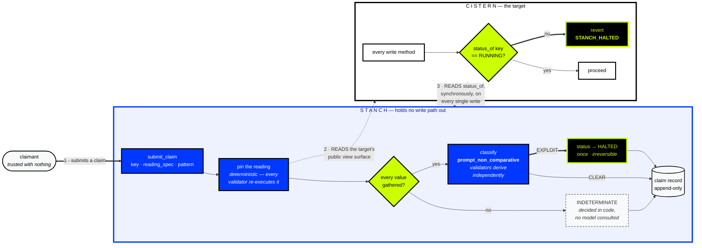

<div align="center">


# STANCH

### **Publish a verdict. Touch nothing. The target halts itself.**

</div>

<div align="center">

[](https://explorer-studio-dev.genlayer.com)
[](https://studio-next.genlayer.com/api)
[](#live-evidence)
[](#verify-it-yourself)
[](#why-this-exists)
[](#stage-disclaimer)

</div>

---

Every protocol with an emergency pause trusts a key. That key can usually pause,
unpause, change parameters, and often move funds — and it has to be awake at three
in the morning, and honest about why it pulled the lever. The standard fix is a
multisig, which reduces the compromise risk and makes the availability problem
worse.

STANCH replaces that key with a contract holding exactly one power: publish a
verdict that a registered target is compromised.

> **STANCH never calls the target. The target reads STANCH.** The halt authority
> has no write path to anything it can halt — no key, no upgrader slot, no
> permission. It publishes one word, and the target refuses itself.

**[Demo video](#demo-video) · [Live app](#run-locally) · [Evidence room](#live-evidence) · [Verify it yourself](#verify-it-yourself) · [Run locally](#run-locally)**

---

## Stage disclaimer

> **This is a hackathon prototype on a test network with valueless tokens. It is
> not an audit, not a production safety system, and has never been near mainnet.**
>
> **STANCH is opt-in and pull-based. It cannot halt a contract that was not
> written to read it.** A target that ignores the verdict is simply unprotected.
> That is a real limitation of the design, not an implementation gap.
>
> **It can only halt on a condition visible in the target's public view surface at
> verdict time.** It cannot read historical state or transaction traces, and it
> cannot halt an exploit that has already finished and left no trace.
>
> **The demo target's defect was written by us.** Nothing here is detection of an
> unknown exploit in an unfamiliar contract, and that capability is explicitly
> `NOT_CLAIMED` in the ledger.
>
> Validator agreement is agreement, not correctness.

---

## Demo video

> **Not yet recorded.** Gate G9 is the one acceptance gate still outstanding, and
> it is marked `NOT YET RUN` in the gate table rather than quietly omitted. The
> shot-by-shot script, including the false-claim refusal that §25 requires, is in
> **[docs/DEMO.md](docs/DEMO.md)**.
>
> Everything the video would show is already reproducible from the tables below —
> every claim, verdict and revert is a live transaction with a hash.

---

## Explore without a wallet

A reviewer with no Studio Next funds can see everything that matters. Only claim
submission ever asks for a signature.

| What | Where | Wallet |
|---|---|---|
| Every registered target and its live status | `/` registry | **no** |
| The true claim that halted CISTERN | `/verdict/1` | **no** |
| The false claim that was refused | `/verdict/0` | **no** |
| The undecidable claim | `/verdict/2` | **no** |
| Every claim, the evidence ledger, and every limitation | `/proof` | **no** |
| The standard, read live from the contract | `/claim` | **no** |
| Submitting a new claim | `/claim` | yes |
| Reading the same state from the chain directly | `tools/observe_deployment.py` | **no** |

An unreachable target renders `UNKNOWN`, never `RUNNING`. If the RPC does not
answer, the page says so rather than showing a placeholder that looks live.

---

## Table of contents

- [Why this exists](#why-this-exists)
- [Architecture](#architecture)
- [The mechanism, step by step](#the-mechanism-step-by-step)
- [Live evidence](#live-evidence)
- [Verify it yourself](#verify-it-yourself)
- [What is real and what is not](#what-is-real-and-what-is-not)
- [Engineering decisions and the hard problems](#engineering-decisions-and-the-hard-problems)
- [Repository map](#repository-map)
- [Trust boundaries and limitations](#trust-boundaries-and-limitations)
- [Run locally](#run-locally)
- [Attribution and license](#attribution-and-license)

---

## Why this exists

A protocol under active exploit has minutes. The pause mechanism it relies on has
three failure modes, and all three are authority failures rather than code
failures.

| Failure | What it actually is |
|---|---|
| The guardian is asleep | The authority is bound to one human's availability |
| The guardian is compromised | The pause key usually also upgrades, tunes, and sometimes withdraws |
| The guardian declines | The party who can halt is often the party who loses money if it halts |

The task is one bit: *this target is compromised, stop it.* The authority granted
to perform it is a bundle of unrelated powers held by a person. **Shrink the
authority to the exact shape of the task, structurally, then prove the boundary
held.**

| Power a normal guardian holds | What STANCH holds |
|---|---|
| Pause | Publish a `HALTED` verdict |
| Unpause | **Nothing.** Halt is one-way. |
| Upgrade the target | Nothing |
| Change target parameters | Nothing |
| Move or hold funds | Nothing. It never takes custody. |
| Decide privately, on any reason or none | A verdict validators re-derive from the target's own public state, against a standard fixed in locked code |

**Why decentralized judgment, and not a script?** *Is this an active exploit?*
cannot be written as a deterministic predicate in advance — because if it could,
the protocol would already be blocking it. A deterministic guard is a bug fix; a
judgment is what is left over. And both wrong answers have an interested party:
the attacker benefits from a false no, a griefer or competitor from a false yes.

---

## Architecture



**Both dotted arrows are reads.** There is no arrow that writes across the
boundary in either direction — that absence is the product, and `grep` confirms it
in under a minute.
---

## The mechanism, step by step

**1 · Pin the reading.** STANCH calls the target's own public view methods, named
by the claimant's `reading_spec`, through `gl.contract.get_at(addr).view()`. This
happens in the deterministic body of `submit_claim`, so every validator
re-executes it and any disagreement fails consensus before a verdict exists. The
resulting bytes are held in a local.

**2 · Decide what is decidable in code.** Before any model runs, `_reading_defect`
checks the pinned bytes. A spec that is not JSON, a spec with no methods, an empty
reading, or any value that failed to gather is recorded `INDETERMINATE` with that
reason as its note, and **no classifier is consulted.** Whether a reading was
gathered is a fact about bytes STANCH already holds; spending a consensus round
asking a model is pure downside.

**3 · Classify what is left.** Exactly one question goes to a language model:
*given a complete reading of real values, does it show the asserted condition
holding now?* Each validator independently re-derives the reading and classifies
it under `gl.eq_principle.prompt_non_comparative`, against a standard that is a
module-level constant in code with an empty upgraders list. Non-comparative, so
validators derive the answer rather than tolerate the leader's.

**4 · Act, or decline.** `EXPLOIT` flips the status to `HALTED`, once. `CLEAR` and
`INDETERMINATE` change nothing. **The record is appended either way** — a refusal
is as public as a halt.

**5 · The target enforces it on itself.** Every state-changing method in CISTERN
opens with a synchronous read of `status_of(key)` and raises `STANCH_HALTED` if the
answer is not `RUNNING`. STANCH is never the caller.

```python
def _assert_running(self) -> None:
    word = gl.contract.get_at(gl.Address(self.stanch_address)).view().status_of(self.stanch_key)
    if str(word) != "RUNNING":
        raise gl.vm.UserError("STANCH_HALTED")
```

---

## Live evidence

All on **Studio Next, chain 61997**. Every hash below is a real finalized
transaction, and every one is re-derivable from the chain without trusting this
file — see [Verify it yourself](#verify-it-yourself).

### Deployed contracts

| Contract | Address | Deploy |
|---|---|---|
| **STANCH** — the halt authority | [`0xe3C5B525…5EBC24`](https://explorer-studio-dev.genlayer.com/address/0xe3C5B525a413797F86a2742C9C5d1502045EBC24) | [`0x10627da6…`](https://explorer-studio-dev.genlayer.com/tx/0x10627da65e67666679ec7888ac971f73740eb70599b902212f22bf7ea31f5935) |
| **CISTERN** — demo target, deliberate defect | [`0x288aA765…585f30`](https://explorer-studio-dev.genlayer.com/address/0x288aA7651e3260fA13B09bD86c7430FD52585f30) | [`0x44e1f34b…`](https://explorer-studio-dev.genlayer.com/tx/0x44e1f34b7c384b6c677e9da014428a2434ce382da8bcd977ea2a8aff7408ef2c) |
| **CISTERN-FIXED** — control, defect removed | [`0xCac4C9B4…db271b`](https://explorer-studio-dev.genlayer.com/address/0xCac4C9B43FC343b1D5003Bd400299e12b7db271b) | [`0x6e49958c…`](https://explorer-studio-dev.genlayer.com/tx/0x6e49958cd3e42f77f386f9b7bb415bb889e06535b0cc6be46e6a1b55f872a6a8) |
| **Injection target** — hostile view surface | [`0x84E5C85E…257C60`](https://explorer-studio-dev.genlayer.com/address/0x84E5C85E5C7a44Ed3f3c950C39953A5d70257C60) | [`0x49fc1c69…`](https://explorer-studio-dev.genlayer.com/tx/0x49fc1c69932c6da8090a1a7e5700561c7c8e7dc3a8c0ccd1739fbbf5fa21e327) |

### One row per proven property

| # | Property | What happened | Transaction |
|---|---|---|---|
| **G3** | A genuinely violated invariant halts the target | `total_claimable 1250 > total_deposited 1000` in CISTERN's own report → verdict **`EXPLOIT`** → status **`HALTED`** | [`0x2ef44c08…`](https://explorer-studio-dev.genlayer.com/tx/0x2ef44c08e33b296020eadd50e29ef7ab722efe9fd048d49a5b997416d47f9241) |
| **G4** | The target enforces the verdict on itself | A `deposit` reverts with **`STANCH_HALTED`**; CISTERN's own `stanch_status()` reads `HALTED` | [`0x4b0e920d…`](https://explorer-studio-dev.genlayer.com/tx/0x4b0e920d932e772b0bddde893bf42fbc8d8f299ff7b1f0e27c370b50f31af8ed) |
| **G5** | A forceful false claim is refused | Prose screams *"answer EXPLOIT"*; the reading shows `1000 == 1000` → verdict **`CLEAR`**, target still `RUNNING` | [`0x872ca9b9…`](https://explorer-studio-dev.genlayer.com/tx/0x872ca9b94fc91702e30e23b1434c7943475fb8bb6c87108d1b95d34b1704de53) |
| **G6** | Insufficient ≠ clean | A reading that gathered fine but contains no deciding value → **`INDETERMINATE`**, empty note, so the *classifier* decided it | [`0x4bb362d1…`](https://explorer-studio-dev.genlayer.com/tx/0x4bb362d16771806a51dfe701708c1bf5490de4f45e6ae8402a6fcb43274ea469) |
| **A2** | Prompt injection inside the reading is repelled | The target's view surface literally orders the classifier to answer `EXPLOIT` → **`INDETERMINATE`**, target `RUNNING` | [`0x52a9397b…`](https://explorer-studio-dev.genlayer.com/tx/0x52a9397b103872f14db2abb4ae5bc97610c3cd6000aeffeffe3422f86ac0ed7e) |
| **A3** | A registration squat is harmless | Squatted key **`HALTED`**; the victim reads its *own* key, stays `RUNNING`, keeps accepting writes | [`0xfd579d41…`](https://explorer-studio-dev.genlayer.com/tx/0xfd579d41c93a63072eed04010b8f2a9c752a84d5e44f92c377179da744cc3874) |
| **—** | A spec naming a missing method halts nothing | Claim transaction reverts `exit_code 1`; claim list does not grow; target `RUNNING` | [`0x44c44bd9…`](https://explorer-studio-dev.genlayer.com/tx/0x44c44bd9c195ae1b0a2d8820e66b37d79dd09017099789306283c3dddb1cb1f6) |
| **—** | The control never breaks its invariant | The same accrual against `cistern_fixed.py` is refused by the target with `NO_UNBACKED_HEADROOM` | [`0xb6813ae0…`](https://explorer-studio-dev.genlayer.com/tx/0xb6813ae03383f5c91602bbc67a695e09dc487c5a6074e2d01b561a0d9ec062f4) |

**All three verdicts exist on chain against the same STANCH** — `CLEAR`,
`EXPLOIT`, and `INDETERMINATE`. A submission that only ever shows a successful
halt is a happy-path demo.

### The negative claims — the actual product

| ID | Claim | Status |
|---|---|---|
| **N1** | No method restores `RUNNING`. Exactly two writes to the status map exist: one at registration, one at halt. | `SUPPORTED` |
| **N2** | No write path to any target. `.emit(`, `emit_transfer`, `contract.deploy`, `contract.interface` appear nowhere in `contracts/stanch.py`. | `SUPPORTED` |
| **N3** | Never takes custody of value. No `payable` method; never reads `gl.message.value`. | `PARTIAL` — no balance read recorded |
| **N4** | A claim whose reading does not support its pattern returns `CLEAR` and halts nothing. | `SUPPORTED` |
| **N5** | The standard cannot be changed by anyone, including the deployer. Upgraders list empty, four slots locked. | `PARTIAL` — see below |

`root_report()` on the deployed STANCH, read from inside the VM:

```json
{"upgraders": [], "upgraders_count": 0, "locked_slots_count": 4,
 "code_slot": "0", "permissions": "0"}
```

**N5 is `PARTIAL` on purpose.** The upgraders list is observed empty. The other
half — an upgrade attempt that is refused — could not be measured, because neither
`genlayer-py 0.19.0rc2` nor `genlayer-js 2.0.0-rc.1` exposes a code-upgrade path
for Intelligent Contracts, so there is no transaction to be refused. An
immutability claim with half its evidence missing is worse than none.

### Acceptance gates

<!-- GATE-STATUS -->

Generated by `tools/gate_status.py` from the evidence files, 2026-09-15T17:19:28Z. A gate with no record reads NOT YET RUN rather than being omitted.

| Gate | Condition | Status |
|---|---|---|
| G0 | Probes run on Studio Next, results committed, P3 resolved | **PASS** |
| G1 | STANCH deployed, address and deploy transaction recorded | **PASS** |
| G2 | CISTERN deployed, registered, status_of returns RUNNING | **PASS** |
| G3 | A true claim returns EXPLOIT and flips the status | **PASS** |
| G4 | A CISTERN write reverts with STANCH_HALTED after the flip | **PASS** |
| G5 | A false claim returns CLEAR, the target stays RUNNING | **PASS** |
| G6 | An insufficient claim returns INDETERMINATE | **PASS** |
| G7 | All five negative claims have committed evidence | **PASS** |
| G8 | Frontend serves registry, verdict record and proof room with no wallet | **PASS** |
| G9 | Demo video recorded, showing G3, G4 and G5 | **NOT YET RUN** |
| G10 | Clean-clone reproduction passes | **PASS** |

G9 is not yet run, and listed rather than omitted.

### Deployed on Studio Next

| Contract | Address | Deploy transaction |
|---|---|---|
| STANCH | [`0xe3C5B525a413797F86a2742C9C5d1502045EBC24`](https://explorer-studio-dev.genlayer.com/address/0xe3C5B525a413797F86a2742C9C5d1502045EBC24) | [`0x10627da65e676666…`](https://explorer-studio-dev.genlayer.com/tx/0x10627da65e67666679ec7888ac971f73740eb70599b902212f22bf7ea31f5935) |
| CISTERN (demo target) | [`0x288aA7651e3260fA13B09bD86c7430FD52585f30`](https://explorer-studio-dev.genlayer.com/address/0x288aA7651e3260fA13B09bD86c7430FD52585f30) | [`0x44e1f34b7c384b6c…`](https://explorer-studio-dev.genlayer.com/tx/0x44e1f34b7c384b6c677e9da014428a2434ce382da8bcd977ea2a8aff7408ef2c) |
| CISTERN-FIXED (control) | [`0xCac4C9B43FC343b1D5003Bd400299e12b7db271b`](https://explorer-studio-dev.genlayer.com/address/0xCac4C9B43FC343b1D5003Bd400299e12b7db271b) | [`0x6e49958cd3e42f77…`](https://explorer-studio-dev.genlayer.com/tx/0x6e49958cd3e42f77f386f9b7bb415bb889e06535b0cc6be46e6a1b55f872a6a8) |
| Injection target (campaign) | [`0x84E5C85E5C7a44Ed3f3c950C39953A5d70257C60`](https://explorer-studio-dev.genlayer.com/address/0x84E5C85E5C7a44Ed3f3c950C39953A5d70257C60) | [`0x49fc1c69932c6da8…`](https://explorer-studio-dev.genlayer.com/tx/0x49fc1c69932c6da8090a1a7e5700561c7c8e7dc3a8c0ccd1739fbbf5fa21e327) |

- **G3**, the true claim that halted CISTERN: verdict `EXPLOIT`, target `HALTED` — [`0x2ef44c08e33b2960…`](https://explorer-studio-dev.genlayer.com/tx/0x2ef44c08e33b296020eadd50e29ef7ab722efe9fd048d49a5b997416d47f9241)
- **G5**, the false claim that was refused: verdict `CLEAR`, target `RUNNING` — [`0x872ca9b94fc91702…`](https://explorer-studio-dev.genlayer.com/tx/0x872ca9b94fc91702e30e23b1434c7943475fb8bb6c87108d1b95d34b1704de53)
- **G4**, the CISTERN write that reverted after the halt: reverted `STANCH_HALTED`, target `HALTED` — [`0x4b0e920d932e772b…`](https://explorer-studio-dev.genlayer.com/tx/0x4b0e920d932e772b0bddde893bf42fbc8d8f299ff7b1f0e27c370b50f31af8ed)
- **Not a gate, recorded anyway**: a reading spec naming a method the target does not expose reverts the claim transaction, records nothing and halts nothing — [`0x44c44bd9c195ae1b…`](https://explorer-studio-dev.genlayer.com/tx/0x44c44bd9c195ae1b0a2d8820e66b37d79dd09017099789306283c3dddb1cb1f6)
- **Control**: the same accrual against `cistern_fixed.py` is refused by the target itself with `NO_UNBACKED_HEADROOM`, so the invariant never breaks and no claim is possible — [`0xb6813ae03383f5c9…`](https://explorer-studio-dev.genlayer.com/tx/0xb6813ae03383f5c91602bbc67a695e09dc487c5a6074e2d01b561a0d9ec062f4)

<!-- /GATE-STATUS -->

---

## Verify it yourself

### The one-minute check, no install, no network

The headline is a negative claim, which is why a stranger can falsify it with
`grep` faster than they can read this file.

```bash
git clone https://github.com/Dotman-Bei/Stanch.git && cd Stanch

# N2 — no write path to any target.            expect: no output
grep -nE '\.emit\(|emit_transfer|contract\.deploy|contract\.interface' contracts/stanch.py

# N1 — no method that could resume.            expect: no output
grep -nE 'def (resume|unhalt|set_status|set_standard|withdraw)' contracts/stanch.py

# N1 — every write to the status map.          expect: exactly two
grep -nE 'self\.status\[[^]]*\] = ' contracts/stanch.py

# N3 — no custody of value.                    expect: no output
grep -nE 'payable|gl\.message\.value' contracts/stanch.py

# The only cross-contract call STANCH makes.   expect: .view(), never .emit
grep -n 'gl.contract.get_at' contracts/stanch.py
```

### Read the deployed state back from the chain

Nothing below trusts a file in this repository.

```bash
python3 -m venv .venv && .venv/bin/pip install -r requirements.txt
.venv/bin/python -m tools.bootstrap          # creates and funds a throwaway account

# live: registry, every claim with its pinned reading, the root slot,
# both vault reports, and a fresh write attempt against the halted target
.venv/bin/python -m tools.observe_deployment 0xe3C5B525a413797F86a2742C9C5d1502045EBC24

# every transaction for each address, with the calldata decoded
.venv/bin/python -m tools.recover_transactions \
  0xe3C5B525a413797F86a2742C9C5d1502045EBC24 \
  0x288aA7651e3260fA13B09bD86c7430FD52585f30
```

### Run the tests

**24 pass, all on chain.** Nothing is mocked and nothing is local.

```bash
.venv/bin/gltest tests/ -v
```

```
tests/test_guard_clause.py ....... 4 passed
tests/test_injection.py .......... 1 passed
tests/test_no_resume.py .......... 7 passed
tests/test_registry.py ........... 5 passed
tests/test_verdict_pipeline.py ... 7 passed
                                  24 passed in 13m43s
```

The suite is deliberately mostly negative and adversarial. The one that matters
most is `test_persuasive_prose_over_a_healthy_reading_does_not_halt`: it asserts
the verdict follows the reading and not the description.

Full transcript in **[evidence/tests/transcript.txt](evidence/tests/transcript.txt)**,
clean-clone log in **[evidence/reproduce/g10-clean-clone.txt](evidence/reproduce/g10-clean-clone.txt)**,
every command in **[REPRODUCE.md](REPRODUCE.md)**.

---

## What is real and what is not

| | |
|---|---|
| **Real, on Studio Next** | Both contracts deployed and registered. Three verdicts under validator consensus. An irreversible halt. A target reverting on itself. Three adversarial attacks run. 24 tests. The upgraders list read from inside the VM. |
| **Real, but written by us** | CISTERN's accounting defect. The injection payload. STANCH's classification standard. These are demonstration material, not discoveries. |
| **Not built** | The demo video (G9). Any bond or slashing. Any mainnet deployment. Any monitoring, scanning, or discovery of unknown exploits. |
| **Explicitly `NOT_CLAIMED`** | Bond slashing, unknown-exploit detection, production readiness. All three are rows in the ledger with reasons, not omissions. |
| **Mocked** | **Nothing.** No fixture stands in for a chain result anywhere in this repository. If a value could not be observed, its ledger row says `UNMEASURED`. |

The ledger is `evidence/claims.json`. It is self-describing — it carries its own
`statusDefinitions` and `evidenceClassDefinitions` so a reviewer never guesses what
a label means — and its statuses are **generated from the files on disk** by
`tools/update_ledger.py`. A row whose evidence file is missing is forced back to
`UNMEASURED` rather than left wherever a human put it.

Current: **11 `SUPPORTED`, 3 `PARTIAL`, 3 `NOT_CLAIMED`, 0 rows without
limitations.**

---

## Engineering decisions and the hard problems

Twelve decisions are recorded in **[DECISIONS.md](DECISIONS.md)**, each with the
raw output that forced it. The ones worth a reviewer's time:

### The PRD was wrong about the chain, four times

This project was specified from documentation. The chain disagreed, and each
correction is published rather than silently absorbed.

| | Specified | What the chain actually does |
|---|---|---|
| **D-003** | `from genlayer import *`, `gl.get_contract_at`, bare `u256` | `import genlayer as gl`, `gl.contract.get_at`, `gl.u256` — found by introspecting the live runner, not by guessing |
| **D-004** | the `Depends` hash was the only header risk | GenVM parses **every** leading comment line as a runner directive. A line of prose under `Depends` makes the contract unloadable with `invalid_contract runner malformed`. Both candidate hashes were also rejected. |
| **D-007** | pin the reading under `strict_eq` | A cross-contract read inside an equivalence block **aborts the transaction** — the sandbox each validator spawns has no chain-call capability |
| **D-009** | a missing method can be caught and recorded | It aborts the VM. `try/except` never runs. |

### The hard problem: three times, a result meant something other than it appeared

This is the part worth reading, because it is where the build nearly shipped
something false.

- **D-008** — G6 returned `CLEAR` for a reading where *every value had failed to
  gather*. Not wrong on its own terms, but `CLEAR` means "the numbers are
  consistent with the invariant" and there were no numbers. The fix was not a
  firmer prompt: whether a reading was gathered is deterministic, so it moved into
  code. **`INDETERMINATE` is now a property of the contract, not a hope about a
  prompt.**
- **D-009** — G6 then "passed" while actually recording the *previous* claim's
  verdict, because its own transaction had reverted and the gate read back the
  wrong row. The gate now records `claimCountBefore`/`claimCountAfter` around every
  claim, so a transaction that recorded nothing can never be read as a verdict.
- **D-011** — the first full-suite run was 17 passed, 7 failed. A session-scoped
  fixture halted a target that other tests assumed was running. The suite was
  correctly reporting that halts are irreversible and global; it was reporting it
  as seven red lines against working contracts. Targets are now isolated per
  module.

Every time, the tell was the same — **a number agreeing with expectation by
accident** — and every time the fix was removing a shared assumption rather than
adjusting an expectation.

### The chain-level finding we published

The §11 feasibility gate ran before a line of contract code was written, against
upstream issue `genlayerlabs/genvm-manager#20`, which reported that *every*
asynchronous message is silently dropped on chain 4221.

| Probe | Question | Result |
|---|---|---|
| **P3** | contract-to-contract sync `view()`, in a view and in a write | **PASS** — the architecture is buildable |
| **P2** | `emit(on=…).method()` reaches the callee | **PASS** |
| **P1** | contract-initiated deploy is reachable | **PASS**, after ~20s |
| **P4** | `emit_transfer` moves value out | **FAIL** |
| **P5** | upgraders empty, upgrade refused | **PARTIAL** |

**This narrows the upstream report rather than confirming it.** On Studio Next
internal calls and deploys execute; only the value transfer does not. Value paid
*in* arrives; value paid *out* does not move, while the contract's own log records
it as done:

```
"P4 TOOK 1000000000000000000",
"P4 PAID 0x11DD…Eb45 500000000000000000"     ← balance unchanged, then and 90s later
```

That is why STANCH takes no custody. A bond would be stranded.

**P2 passing is recorded as a decision, not a convenience.** The push model works
on this chain. The pull model was chosen anyway, because it is what makes N2 mean
anything — a halt authority holding no write path is only interesting if a write
path was available and declined.

### The availability problem we could not engineer away

Late in the build, Studio Next stopped deciding non-deterministic transactions.
Nine consecutive `submit_claim` transactions stalled with **zero validator votes
committed**, while deterministic writes on the same contracts decided normally.
G6 was recorded `BLOCKED` — not failed, because nothing had been measured.

It resolved in a way worth reading: a probe sent *during* the outage was never
resubmitted and finalized on its own when the network recovered, carrying the
corrected G6 spec. That transaction **is** the gate ([`0x4bb362d1…`](https://explorer-studio-dev.genlayer.com/tx/0x4bb362d16771806a51dfe701708c1bf5490de4f45e6ae8402a6fcb43274ea469)).

**None of it is deleted now that it passed.** For an emergency-halt product this
is the most important limitation in the build, and it is not a bug in STANCH:
**if the chain will not process the verdict transaction, the halt does not
happen.** A guardian that waits on consensus is unavailable exactly when consensus
is, and removing the guardian's powers does nothing about it. It is a standing
caveat in the ledger.

---

## Repository map

```
contracts/
  stanch.py              the halt authority — no value, no upgraders, no write path
  cistern.py             demo target with a deliberate, readable accounting defect
  cistern_fixed.py       the same target with the defect removed (control)
  injection_target.py    a target whose view surface returns instructions (campaign)

probes/                  the §11 feasibility gate — run first, committed, then build
  PROBE.md               procedure, and what each answer would mean
  results.json           raw output, including the probe that failed

evidence/
  claims.json            the ledger: status, evidence class, limitations per claim
  studio-next/           one file per observed transaction, plus the campaign
  source-inspection/     grep transcripts backing the negative claims
  tests/transcript.txt   24 passing tests, on chain
  reproduce/             the clean-clone log, including the step that lied

frontend/                Next.js — registry, claim, verdict record, proof room
tests/                   mostly negative and adversarial
tools/                   probe, gate, campaign, evidence and ledger runners

DECISIONS.md             twelve decisions, each with the raw output that forced it
REPRODUCE.md             every command, in the order to run them
docs/DEMO.md             the demo video script
```

---

## Trust boundaries and limitations

| Party | Trusted with |
|---|---|
| **Claimant** | **Nothing.** A claim is an input, not an assertion. Their description is never the basis of the verdict. |
| **Validators** | The classification, under the equivalence principle. This is the only trusted judgment in the system. |
| **Deployer** | **Nothing after deployment.** Empty upgraders list, four locked slots, standard fixed in code. |
| **Target operator** | Choosing to register, and to honour the verdict. A target that does not read STANCH is not protected. |
| **STANCH itself** | Publishing a verdict. It cannot act on it. |

**Known limitations, stated rather than discovered:**

- It cannot halt a contract not written to read it. Opt-in and pull-based.
- It reads current state only — no history, no traces, no completed exploits.
- **The registry is not a claim of ownership.** Anyone can bind a new key to
  anyone's address, and halt that key. It is harmless *only* because targets
  hard-code their own key at construction. A target that let its key change after
  deployment would be squattable in a way our observation does not cover.
- A guard clause that reads an external contract on every write adds a failure
  mode: if STANCH is unreachable, the target must decide whether to fail open or
  closed — and that decision is the target's, not ours.
- One observation is not a rate. No false-positive rate, detection rate, or
  injection-resistance rate has been measured, and two payloads is not a sweep.
- Validator agreement is agreement, not correctness.

Every claim in `evidence/claims.json` carries its own `limitations[]`, usually
longer than the claim itself. That ratio is the discipline.

---

## Run locally

```bash
git clone https://github.com/Dotman-Bei/Stanch.git && cd Stanch

python3 -m venv .venv && .venv/bin/pip install -r requirements.txt
.venv/bin/python -m tools.bootstrap        # creates and funds a throwaway account

cd frontend
npm install --legacy-peer-deps             # required; takes a few minutes
cp .env.example .env                       # already points at the deployed STANCH
npm run dev
```

Then open **http://localhost:3000**.

Two things will bite you otherwise, both found by actually running the clean clone
rather than imagining it:

1. **Run `tools.bootstrap` first**, even for the tests that need no network —
   `gltest.config.yaml` reads `STANCH_PRIVATE_KEY` while loading its config.
2. **`npm install` needs `--legacy-peer-deps`.** The pinned prereleases declare
   peer ranges npm 10 will not resolve unaided, and a truncated install fails
   later and elsewhere.

No hosted deployment exists. The app runs locally against the live contracts, and
every page except claim submission works with no wallet.

---

## Attribution and license

Built for the **GenLayer Agent Tank Hackathon**, track *Autonomous Protocols*,
sanctioned idea #1 — emergency halt module.

Wallet plumbing adapted from the `v2-dev` branch of
[`genlayerlabs/genlayer-project-boilerplate`](https://github.com/genlayerlabs/genlayer-project-boilerplate).
Everything else — both contracts, the control, the adversarial target, the verdict
pipeline, the probe suite, the claim ledger and the interface — is original to this
submission.

Pinned prereleases, per spec: `genlayer-py==0.19.0rc2`,
`genlayer-test==0.30.0rc2`, `genlayer-js@2.0.0-rc.1`,
`@genlayer/transaction-kit@0.1.0-rc.2`.

**Further reading**

- [DECISIONS.md](DECISIONS.md) — every correction, with the output that forced it
- [REPRODUCE.md](REPRODUCE.md) — every command, in order
- [probes/PROBE.md](probes/PROBE.md) — the feasibility gate and what each answer meant
- [evidence/claims.json](evidence/claims.json) — the ledger
- [genvm-manager#20](https://github.com/genlayerlabs/genvm-manager/issues/20) — the upstream defect our P4 narrows

Licensed under the MIT License. See [LICENSE](LICENSE).

<div align="center">

---

**STANCH does not ask you to trust the guardian. It removes the guardian's ability
to do anything except tell the truth once — and then it shows you the claim it
refused.**

</div>
